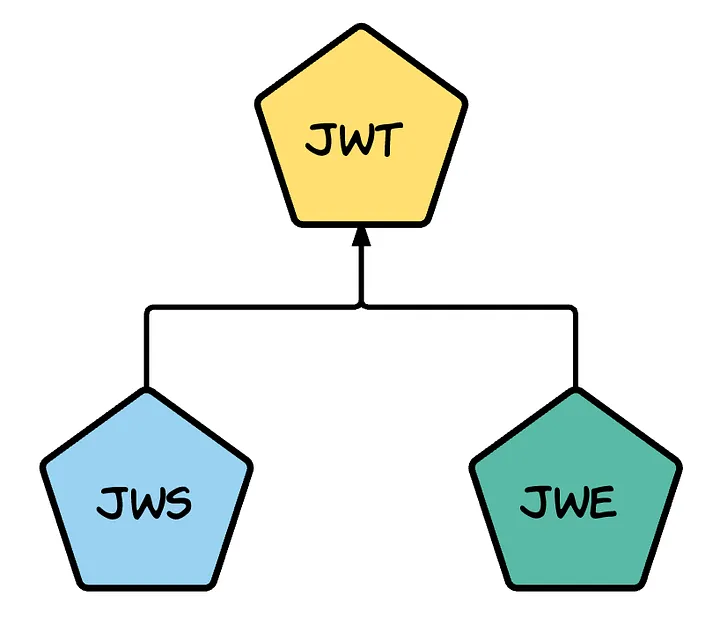

# JSON Web Encryption (JWE) token validator

This is a repository containing an Azure Functions project that demonstrates how to validate JSON Web Encryption (JWE) tokens using the `JsonWebTokenHandler` class in the `System.IdentityModel.Tokens.Jwt` namespace. The project includes a sample HTTP trigger function that accepts a JWE token in the `Authorization` header of an HTTP request, validates the token, and returns a response indicating whether the token is valid or not.

The `JsonWebTokenHandler` class provides methods for validating and creating JWE tokens, as well as for reading and writing token data. The class supports a variety of encryption algorithms and key types, making it a flexible and powerful tool for working with JWE tokens.

This project is intended as a starting point for developers who need to work with JWE tokens in their Azure Functions projects. It includes sample code that demonstrates how to validate tokens using the `JsonWebTokenHandler` class, as well as how to configure the class to use different encryption algorithms and key types.

To use this project, you will need to have the Azure Functions Core Tools installed on your machine. You will also need to configure your Azure Functions project to use the `System.IdentityModel.Tokens.Jwt` namespace, which can be done by adding a reference to the `System.IdentityModel.Tokens.Jwt` NuGet package.

For more information on working with JWE tokens in Azure Functions, see the [official Azure Functions documentation](https://docs.microsoft.com/en-us/azure/azure-functions/functions-bindings-jwt-token).

GitHub Copilot: Sure! Here's the merged text formatted in Markdown:

## JWE and JWS Tokens

JSON Web Encryption (JWE) and JSON Web Signature (JWS) are both standards for securing data in JSON format, but they serve different purposes.

JWE is used to encrypt data in transit, while JWS is used to sign data to ensure its authenticity and integrity.

JWE tokens are used to securely transmit data between parties in a way that prevents unauthorized access or tampering. They consist of three parts: a header, a payload, and a signature. The header contains metadata about the encryption algorithm and key used to encrypt the payload. The payload contains the data being transmitted. The signature is used to verify the integrity of the token and ensure that it has not been tampered with.

JWS tokens, on the other hand, are used to sign data to ensure its authenticity and integrity. They consist of two parts: a header and a payload. The header contains metadata about the signing algorithm and key used to sign the payload. The payload contains the data being signed. The signature is used to verify the authenticity and integrity of the data.

JWE tokens are commonly used in web applications to transmit sensitive data, such as user credentials or payment information, between the client and server. They are also used in machine-to-machine communication to securely transmit data between different systems.

JWS tokens, on the other hand, are commonly used to authenticate users and authorize access to resources in web applications. They are also used in machine-to-machine communication to securely transmit data between different systems.

To use JWE and JWS tokens in your application, you will need to implement a JWE or JWS library or use an existing one. The library will provide methods for encrypting, decrypting, signing, and verifying tokens, as well as for reading and writing token data. You will also need to configure your application to use the appropriate encryption or signing algorithm and key for your use case.

The `azuere-functions-jwe-token-validator` repository contains an Azure Functions project that demonstrates how to validate JWE tokens using the `JsonWebTokenHandler` class in the `System.IdentityModel.Tokens.Jwt` namespace. The project includes a sample HTTP trigger function that accepts a JWE token in the `Authorization` header of an HTTP request, validates the token, and returns a response indicating whether the token is valid or not.
